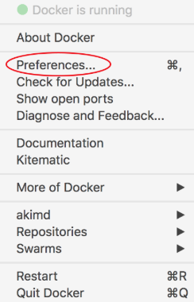
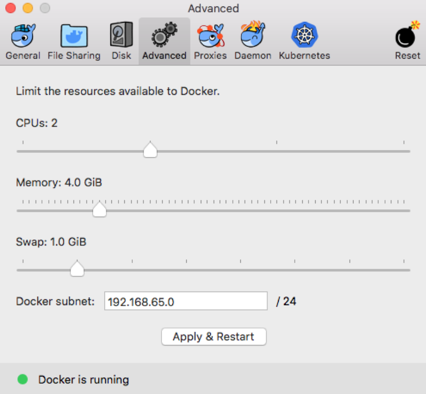
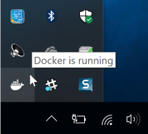
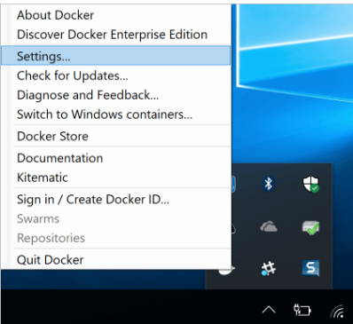
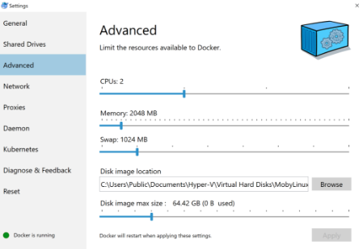
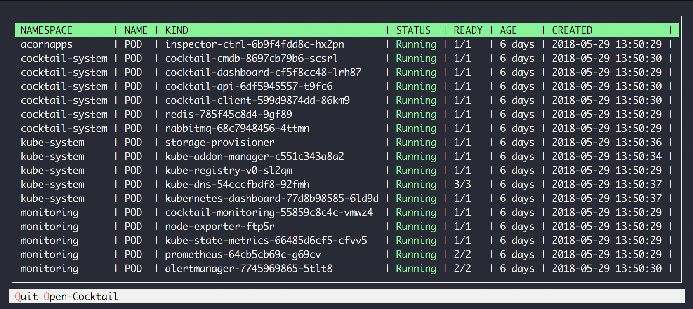
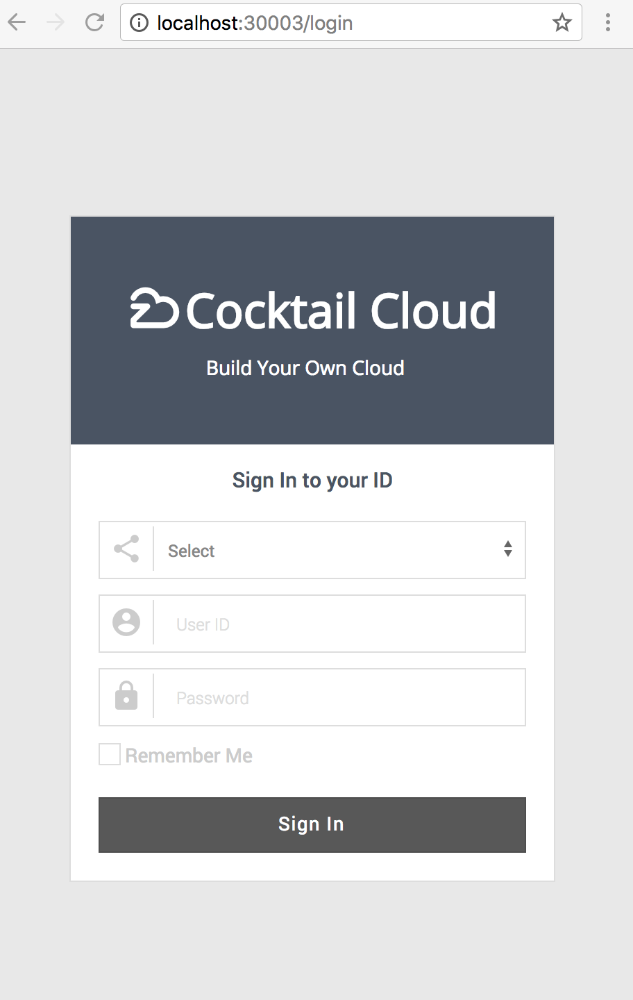
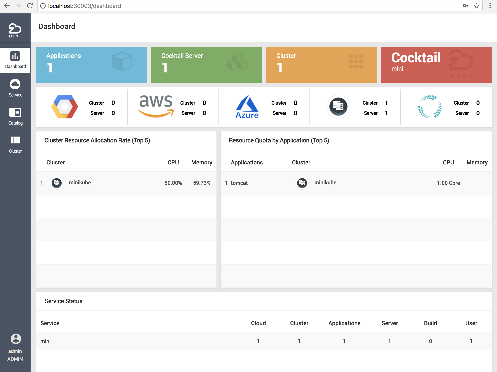

# Minic

## Welcome to Minic!

Minic is a tool that helps you run Cocktail Cloud locally by running a single-node Kubernetes cluster inside a Docker. Actually, Minic runs a single container(called “Cocktail mini container”) that packages Cocktail Cloud and Kubernetes cluster.

This documentation contains the sections to help you get started with Cocktail Mini.

## Installing Minic

### 1. System requirements

Minic is available on multiple operating systems.

* macOS : El Capitan 10.11 and newer macOS releases
* Windows : Windows 10 Pro, Enterprise and Education (1607 Anniversary Update, Build 14393 or later)
* Ubuntu : Xenial 16.04(LTS) and newer

Minic requires at least 2 cores of CPU and 4 Gbytes of memory. So, your device(PC, notebook etc.) should have more resources then this requirements.

* 2 Cores of CPU or above
* 8 Gbytes of memory or above

### 2. Install Docker

Minic requires Docker to run the Cocktail mini container. Install Docker, depending on your host operating system. Refer to following link.

[Docker install](https://docs.docker.com/install/)

In macOS and Windows, Docker is launched on virtual machine that is hosted on your PC
or notebook. So, all containers(including Cocktail mini container) only use resources that the virtual machine has.
Because of this reason, you should configure the Docker’s advanced options of resources for running Minic.

### 3. Configure Docker resources setting

**Docker for Mac**

Click the whale in the top status bar, and choose “Preferences” menu.




On the Advanced tab, you can see the resources available to Docker. Set the CPUs value to 2 cores and the Memory value to 4.0 GiB as follows.



**Docker for Windows**

Open the Docker for Windows menu by right-clicking the Docker icon in the Notifications area (or System tray).



Select Settings... to open the Settings dialog.



On the Advanced tab, you can see the resources available to Docker. Set the CPUs value to 2 cores and the Memory value to 4096 MB. The Linux VM restarts after changing the settings on the Advanced tab. This takes a few seconds.



### 4. Download and install Minic

Minic is distributed in zip or tar.gz file that is consists of a single executable file.

Download the Minic distribution file from following links, depending your operating system.

* [Darwin/amd64(macOS)](https://github.com/acornapps/minic/releases/download/v0.4/minic-darwin-amd64.zip)
* [Windows/amd64](https://github.com/acornapps/minic/releases/download/v0.4/minic-windows-amd64.zip)
* [Linux/amd64](https://github.com/acornapps/minic/releases/download/v0.4/minic-linux-amd64.zip)

After downloading, unzip the downloaded file to your PATH directory.

Now, you ready to run Minic.

### 5. Running Minic

To run minic, type the “start” command on your prompt.

```
$ minic start
```

The `minic start` command has several steps on processing.

At first, the start command download the Cocktail mini container image. It takes one or more minutes, depending your network speed. And then, it runs kubernetes cluster and Cocktail mini. At this time, your prompt is changed to “status mode”.(see following image)



Cocktail mini is consist of containers(pods) that are run on kubernetes. So, you should wait untill all containers are run. (As like the above image, all pod status will be changed to “Running(green)” when to be ready)

Type “o” to open Cocktail mini and you can see the login screen of Cocktail mini as following.



Only one user is available on The Cocktail mini.

* Role : Admin
* Id : admin@acornsoft.io
* Password : admin0000

After you logined, you can see the main dashboard of Cocktail mini.



Now you can experience the Cocktail Cloud !
